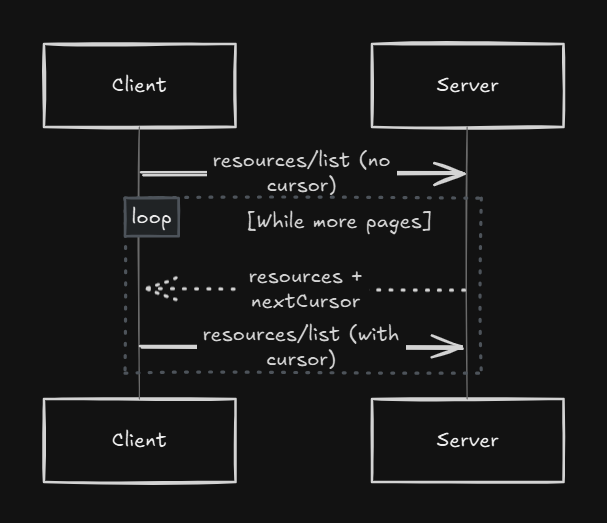

Pagination in the Model Context Protocol (MCP) lets clients fetch large lists in small, manageable chunks rather than pulling everything at once. Under the 2025-06-18 revision, MCP adopts a **cursor-based** approach:

---

## 1. Cursor-Based Model

* **Opaque Cursor:** The server returns a `nextCursor` token—just a string. Clients don’t parse it; they simply hand it back to request the next page.
* **Server-Determined Page Size:** Different servers may choose different page sizes. Clients **MUST NOT** assume a fixed size. ([modelcontextprotocol.io][1])

---

## 2. First Response Format

When you do your initial list call (e.g. `resources/list` or `tools/list`), the server may reply with:

```json
{
  "jsonrpc": "2.0",
  "id": "123",
  "result": {
    "resources": [ /* up to N items */ ],
    "nextCursor": "eyJwYWdlIjogM30="
  }
}
```

* **`resources`** (or `tools`, `prompts`, etc.): your current batch.
* **`nextCursor`**: present only if more data remains. ([modelcontextprotocol.io][1])

---

## 3. Continuing Pagination

To get the *next* batch, issue the same list method but include the cursor:

```json
{
  "jsonrpc": "2.0",
  "method": "resources/list",
  "params": {
    "cursor": "eyJwYWdlIjogM30="
  }
}
```

The server will return the next set plus, again, a `nextCursor` if there’s still more.

---

## 4. Pagination Loop



Here’s the same pagination loop spelled out step-by-step:

1. **Client → Server:**
   Send your first `resources/list` request **without** a cursor.

2. **Server → Client:**
   Returns the first page of results (e.g. items 1–N) **plus** a `nextCursor` token.

3. **Client → Server:**
   Send `resources/list` again, now including the `cursor` you just received.

4. **Server → Client:**
   Returns the next page of results (e.g. items N+1–2N) and, if there’s still more data, a new `nextCursor`.

5. **Repeat Steps 3–4**
   Keep handing back each `nextCursor` until the server’s response omits it—then you’ve fetched all pages.

---

That “omit `nextCursor`” is your signal that you’ve reached the end of the list.

---

## 5. Operations That Support Pagination

* `resources/list`
* `resources/templates/list`
* `prompts/list`
* `tools/list`

Servers may extend cursor-based paging to other tool calls, but these are the core list operations.

---

## 6. Server & Client Guidelines

### Servers **SHOULD**

* Generate **stable** cursors (same cursor → same page).
* Validate and **gracefully** reject invalid cursors (error `-32602`). ([modelcontextprotocol.io][1])

### Clients **SHOULD**

* Treat a **missing** `nextCursor` as “no more data.”
* Allow for **non-paginated** flows (i.e., servers might return all data at once).

### Clients **MUST**

* Keep cursors **opaque**: don’t inspect, parse, or cache them across sessions. ([modelcontextprotocol.io][1])

---

## 7. Error Handling

If the client sends a malformed or expired cursor, servers **SHOULD** respond with a JSON-RPC error:

```json
{ "code": -32602, "message": "Invalid params: cursor is not valid" }
```

After that, clients can decide to restart from scratch (omitting the cursor) or abort.

---

**In essence**, MCP pagination is a simple, robust way to traverse large lists:

1. **Request** → get a batch + opaque `nextCursor`.
2. **Repeat** with cursor until it disappears.
3. **Respect** server’s page size and never assume internals of the cursor.

This pattern keeps both clients and servers performing efficiently—no giant payloads, no brittle page-number math, and seamless handling of very large data sets.

[1]: https://modelcontextprotocol.io/specification/2025-06-18/server/utilities/pagination?utm_source=chatgpt.com "Pagination - Model Context Protocol"
