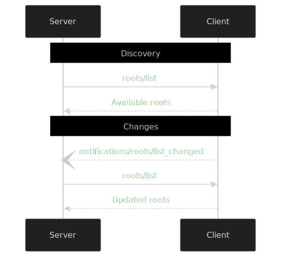

### What is MCP and Why Do We Need Roots?

**Model Context Protocol (MCP)** is a standardized way for development tools (like code editors or IDEs) and servers (like code analyzers or linters) to communicate with each other. Think of MCP as a set of rules that allows a code editor (the **client**) to talk to a tool (the **server**) about a project, so the tool knows what files and folders it can work with.

**Roots** in MCP are like the "home base" for a project. They tell the server which directories (folders) it’s allowed to access and work within. Without Roots, the server would either need you to manually tell it where your project files are (which is tedious) or it might try to access files it shouldn’t, which could be insecure.

**Analogy**: Imagine you’re giving a friend directions to your house (the project). Instead of saying, “Look everywhere in the city,” you give them a specific address (the Root). This keeps things safe, clear, and efficient.

---

### What Are Roots in MCP?

Roots are specific folders that a client (like an IDE or code editor) shares with a server to define the boundaries of a project. These folders are the starting points for the server to explore and work with your project files. Each Root has:

1. **URI**: A unique address for the folder, using a `file://` format (e.g., `file:///home/user/projects/myproject`).
2. **Name** (optional): A human-readable name for the folder, like “My Project,” to make it easier to identify.

**Example**: If you’re working on a web app, the Root might be the folder where all your code lives, like `/home/user/my-web-app`. The server uses this Root to know it can only look at files inside that folder.

---

### Why Are Roots Important?

Roots solve a big problem in development tools: **context awareness**. Without Roots, tools wouldn’t know which files belong to your project. For example:
- A linter (a tool that checks for code errors) needs to know which files to check.
- A code completion tool needs to know which folders contain your project’s source code.
- A build tool needs to know where to find resources to compile.

Roots let the client automatically tell the server, “Here’s my project folder, work with this!” This saves you from manually configuring paths and makes tools smarter and safer.

**Analogy**: Think of a librarian (the server) trying to find books in a huge library (your computer). Without Roots, the librarian would wander aimlessly. Roots are like saying, “Only look in the sci-fi section (the project folder).”

---

### How Do Roots Work in MCP?

Let’s break down the process of how Roots are used in MCP, step-by-step:

#### 1. **Client Declares Roots Capability**
When the client (e.g., your code editor) connects to the server, it tells the server, “I support Roots!” This is done during the **initialization** phase by including a `roots` capability in a JSON message.

**Example JSON** (from the documentation):
```json
{
  "capabilities": {
    "roots": {
      "listChanged": true
    }
  }
}
```
- `listChanged: true` means the client will notify the server if the list of Roots changes (e.g., if you add a new project folder).

#### 2. **Server Requests the List of Roots**
The server canਕ

System: sends a `roots/list` request to the client to get the list of Roots.

**Example Request** (from the documentation):
```json
{
  "jsonrpc": "2.0",
  "id": 1,
  "method": "roots/list"
}
```

The client responds with a list of Roots, each with a URI and optional name.

**Example Response**:
```json
{
  "jsonrpc": "2.0",
  "id": 1,
  "result": {
    "roots": [
      {
        "uri": "file:///home/user/projects/myproject",
        "name": "My Project"
      }
    ]
  }
}
```

#### 3. **Server Uses the Roots**
The server uses the Root URIs to access and analyze files within those folders. For example, it might scan for Python files (like in the `server.py` code) or perform other tasks like linting or code completion.

#### 4. **Root List Changes**
If the client supports `listChanged`, it sends a notification to the server when the list of Roots changes (e.g., you add or remove a project folder).

**Example Notification**:
```json
{
  "jsonrpc": "2.0",
  "method": "notifications/roots/list_changed"
}
```

The server can then request the updated list of Roots.

**Mermaid Diagram** (from the documentation):


---

### Real-World Example

Let’s see how Roots work in practice, using the provided `client.py` and `server.py` code.

1. **Client Setup** (`client.py`):
   - The client declares a single Root: the current working directory.
   - It responds to `roots/list` requests with a JSON object containing the Root’s URI and name.

   **Code Snippet**:
   ```python
   async def mock_roots_list(context: RequestContext["ClientSession", Any]) -> types.ListRootsResult | types.ErrorData:
       root_uri = f"file://{Path.cwd().absolute()}"
       return types.ListRootsResult(roots=[types.Root(
           uri=types.FileUrl(root_uri),
           name="Current Project"
       )])
   ```

2. **Server Analysis** (`server.py`):
   - The server requests the Roots using `ctx.session.list_roots()`.
   - It analyzes the first Root by listing all Python files (`*.py`) in the folder.

   **Code Snippet**:
   ```python
   roots = await ctx.session.list_roots()
   root = roots.roots[0]
   path = Path(urlparse(root.uri).path)
   py_files = list(path.glob("**/*.py"))
   analysis = f"Found {len(py_files)} Python files in project at {path}"
   ```

3. **Running the Demo**:
   - Start the server: `uv run uvicorn server:mcp_app --reload`
   - Run the client: `uv run python client.py`
   - The client sends the Root to the server, and the server responds with an analysis (e.g., “Found 5 Python files in project at /home/user/myproject”).

---

### Security and Best Practices

Roots are designed to keep things secure by limiting the server’s access to specific folders. Here are key security considerations:

1. **Client Responsibilities**:
   - Only share Roots that the user has explicitly allowed.
   - Validate URIs to prevent **path traversal** attacks (e.g., accessing `../../secret` files).
   - Check permissions to ensure the server can only access allowed files.

   **Example Code** (from the GitHub README):
   ```python
   if not is_path_within_root(file_path, root_path):
       raise SecurityError("Path traversal attempt")
   ```

2. **Server Responsibilities**:
   - Only access files within the provided Roots.
   - Handle cases where Roots become unavailable (e.g., a folder is deleted).
   - Cache Root information to avoid repeated requests, but refresh when notified of changes.

3. **User Consent**:
   - The client should ask the user for permission before sharing Roots with the server.
   - Provide a clear interface (e.g., a folder picker) for users to select Roots.

---

### Real-World Applications

Roots make development tools smarter and more efficient. Here are some examples:

1. **IDEs (like VS Code or PyCharm)**:
   - Use Roots to define workspace folders for code completion, search, or linting.
   - Example: VS Code shares the opened project folder as a Root.

2. **Build Tools**:
   - Use Roots to find source files for compilation or packaging.
   - Example: A build tool scans the Root for `*.java` files to compile a Java project.

3. **Code Analyzers**:
   - Use Roots to analyze project structure or generate documentation.
   - Example: A linter scans Python files in the Root to check for errors.

**Analogy**: Roots are like a map for a treasure hunt. The map (Root) tells the treasure hunter (server) exactly where to look for treasure (files) and keeps them from wandering into dangerous areas (unauthorized folders).

---

### Visualizing Roots

Here’s a simple analogy to visualize Roots:

- **Your computer**: A giant library with thousands of books (files).
- **Roots**: Specific bookshelves (folders) you tell the librarian (server) to look at.
- **Server’s job**: Find and analyze books (files) only on those shelves.

**Example**:
- You open a project folder `/home/user/my-web-app` in VS Code.
- VS Code (the client) tells a linter (the server) that the Root is `file:///home/user/my-web-app`.
- The linter scans only that folder for JavaScript files to check for errors.

---

### Challenges and Known Issues

The GitHub README mentions a bug in the MCP Python SDK (version 1.10.1) where the `roots/list` request can get stuck. This happens when:
- The client initializes with Roots capability.
- The server requests Roots using `ctx.session.list_roots()`.
- The communication hangs.

**Workaround**: Until the bug is fixed, developers can test with mock data or use alternative methods to share Roots (e.g., manual configuration).

---

### Practice Exercises

To deepen your understanding, try these exercises (from the GitHub README):

1. **Expose Multiple Roots**:
   - Modify `client.py` to return multiple Roots, like a frontend and backend folder.
   - Example: Add `{"uri": "file:///home/user/repos/frontend", "name": "Frontend"}` to the `roots` list.

2. **Filter Files**:
   - Modify `server.py` to filter files by type (e.g., only `.js` files).
   - Example: Change `path.glob("**/*.py")` to `path.glob("**/*.js")`.

3. **Detect Project Features**:
   - Add code to `server.py` to detect project features, like the presence of a `README.md` or `.git` folder.
   - Example: `if (path / "README.md").exists(): analysis += "\nREADME found"`

---

### Key Takeaways

1. **Roots define project boundaries**: They tell servers which folders to work with, making tools context-aware.
2. **Client-server communication**: Clients share Roots via JSON-RPC messages, and servers use them for tasks like analysis or linting.
3. **Security is critical**: Validate paths, check permissions, and get user consent to keep Roots safe.
4. **Real-world impact**: Roots power IDEs, build tools, and code analyzers by providing automatic project context.

---

### Additional Resources

- [MCP Roots Specification](https://modelcontextprotocol.io/specification/2025-06-18/client/roots)
- [Project Context Best Practices](https://12factor.net/)
- [MCP Blog on Project Context](https://modelcontextprotocol.io/blog/project-context)

---

I hope this explanation has made Roots in MCP clear and intuitive! If you have any questions or want to dive deeper into a specific part (e.g., the code or security), let me know, and I’ll provide more details.