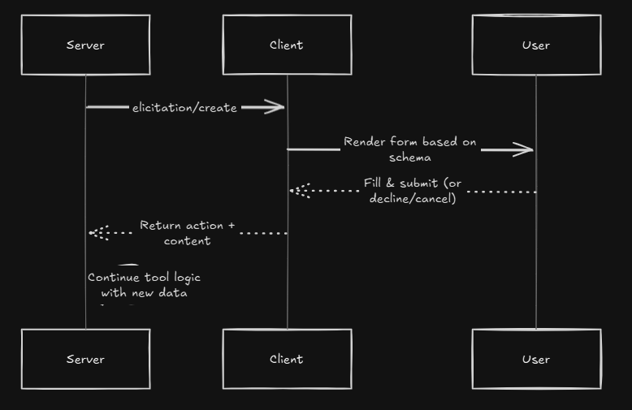

## 1. What Is Elicitation?

**Elicitation** lets an MCP **server** pause tool execution and ask the **user** (via the client) for additional structured information—then resume once a valid answer arrives ([Model Context Protocol][1]). It’s like a built-in “question & answer” step in your tool, replacing rigid, all-parameters-up-front APIs with dynamic, interactive dialogs.

### Key Points

* Servers send an `elicitation/create` request with:

  * A **message** prompt (e.g. “Please enter your GitHub username”)
  * A **JSON Schema** describing exactly what data is needed
* The client **renders** that as a form, validates the response, and returns one of:

  * **accept** (with data matching the schema)
  * **decline** (user says no)
  * **cancel** (user dismisses the dialog)

---

## 2. Why & When to Use Elicitation

### 2.1 Problems with Static Tools

* **Up-front parameters only:** Users must know and supply every option before running the tool.
* **Wasted prompts:** If a parameter isn’t needed (e.g. toppings on a plain pizza), you still asked for it.

### 2.2 Benefits of Elicitation

1. **Progressive disclosure:** Ask for details *only* when needed.
2. **Conditional flows:** Branch questions based on earlier answers.
3. **Built-in validation:** JSON Schema ensures correct types and formats.
4. **Better UX:** Guided forms reduce error and confusion.

Use elicitation in scenarios like:

* Gathering optional preferences (e.g. “Add extra toppings?”)
* Collecting multi-field contact info
* Breaking complex workflows into smaller, interactive steps

---

## 3. Core Protocol Messages

### 3.1 Capability Declaration

Clients must signal they support elicitation in their `initialize` response:

```json
{
  "capabilities": {
    "elicitation": {}
  }
}
```

### 3.2 Creating an Elicitation Request

**Request** (`elicitation/create`):

```json
{
  "jsonrpc": "2.0",
  "id": 42,
  "method": "elicitation/create",
  "params": {
    "message": "Please provide your contact info",
    "requestedSchema": {
      "type":"object",
      "properties":{
        "name":{"type":"string"},
        "email":{"type":"string","format":"email"}
      },
      "required":["name","email"]
    }
  }
}
```

**Response** (one of):

```json
// Accept
{"jsonrpc":"2.0","id":42,"result":{
  "action":"accept",
  "content":{"name":"Alice","email":"alice@example.com"}
}}

// Decline
{"jsonrpc":"2.0","id":42,"result":{"action":"decline"}}

// Cancel
{"jsonrpc":"2.0","id":42,"result":{"action":"cancel"}}
```

Handling these three clear outcomes lets your server decide how to proceed or fallback.

---

## 4. Typical Message Flow



---

## 5. Implementing Elicitation

### 5.1 Server-Side (Python / FastMCP)

1. **Stateful HTTP is required** (`stateless_http=False`).
2. **Define your Pydantic schema** for easy server-side typing.
3. **Call `ctx.elicit(...)`** where you need user input.

```python
from pydantic import BaseModel, Field
from mcp.server.fastmcp import FastMCP, Context

mcp = FastMCP(name="elicitation-server", stateless_http=False)

class OrderPreferences(BaseModel):
    want_toppings: bool = Field(..., description="Add extra toppings?")
    toppings: str    = Field("mushrooms", description="Toppings (comma-separated)")

@mcp.tool()
async def order_pizza(ctx: Context, size: str) -> str:
    result = await ctx.elicit(
        message=f"Ordering a {size} pizza. Customize?",
        schema=OrderPreferences
    )
    if result.action == "accept" and result.data.want_toppings:
        return f"{size} pizza with {result.data.toppings}"
    if result.action == "decline":
        return f"{size} plain pizza"
    return "Order cancelled"

mcp_app = mcp.streamable_http_app()
```

### 5.2 Client-Side (Python Example)

Implement an `elicitation_callback` that renders a UI or prompts the user:

```python
import mcp.types as types
from mcp.shared.context import RequestContext
from typing import Any

async def mock_elicitation(
    context: RequestContext["ClientSession", Any],
    params: types.ElicitRequestParams
) -> types.ElicitResult | types.ErrorData:
    print("<- Client: Received 'elicitation' request from server.")
    print(f"<- Client Prompt: {params.message}")
    # Show the user the schema if you want:
    # print(f"<- Expected schema: {params.requestedSchema}")

    user_input = input("Would you like to add extra toppings? (y/n/c for cancel): ")

    if user_input.lower() == "y":
        return types.ElicitResult(
            action="accept",
            content={"want_toppings": True, "toppings": "fajita, pepperoni, mushrooms"}
        )
    elif user_input.lower() == "c":
        return types.ElicitResult(action="cancel")
    else:
        return types.ElicitResult(action="decline")


async with streamablehttp_client("http://localhost:8000/mcp/") as (r,w,_):
    async with ClientSession(r, w, elicitation_callback=mock_elicitation) as sess:
        await sess.initialize()
        result = await sess.call_tool("order_pizza", {"size":"large"})
        print("Result:", result.content[0].text)
```

---

## 6. Advanced Patterns

### 6.1 Nested Elicitations

You can nest multiple `ctx.elicit()` calls in one tool to build multi-step wizards:

```python
step1 = await ctx.elicit(...schema=Step1Schema)
if step1.data.needs_more:
    step2 = await ctx.elicit(...schema=Step2Schema)
    ...
```

### 6.2 Conditional Logic & Defaults

Leverage schema defaults and conditional prompts to simplify flows:

```python
class Pref(BaseModel):
    color: str = Field("blue", description="Favorite color?")
    shade: str = Field(None, description="Shade (if custom)")
# Ask for shade only if color=="custom"
```

---

## 7. Best Practices

1. **Keep schemas flat & focused.** Avoid nested objects or arrays.
2. **Use clear, user-friendly messages.** Explain why you need the data.
3. **Validate generously.** Schema `format` and `min/max` catch errors early.
4. **Offer decline & cancel.** Never trap users in unwanted dialogs.
5. **Log interactions.** Helps with auditing and debugging.

---

## 8. Common Use-Cases

* **Onboarding flows:** Gather user profile info step-by-step.
* **Configuration wizards:** Ask only for settings that matter.
* **Approval steps:** Get explicit user confirmation before risky actions.

---

By following this guide, you can implement elicitation in MCP from the ground up—designing tools that interactively guide users, validate inputs, and seamlessly integrate those inputs back into your server-side logic. You’ll be able to explain not just **what** elicitation is, but **why** and **how** to build powerful, user-centric workflows with it.

[1]: https://modelcontextprotocol.io/specification/draft/client/elicitation?utm_source=chatgpt.com "Elicitation - Model Context Protocol"
