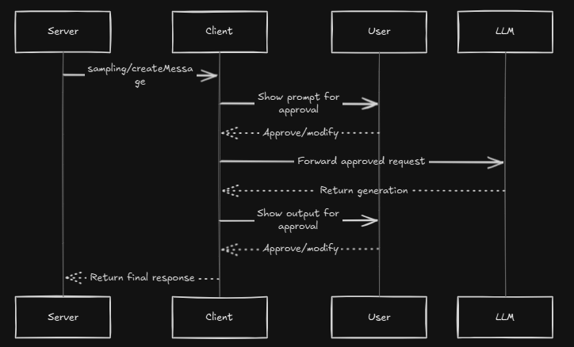

**Sampling in MCP: From Basics to Advanced**

---

## 1. What Is Sampling in MCP?

**Sampling** in the Model Context Protocol (MCP) is the mechanism by which an MCP **server** delegates the task of generating text (or other content) to an LLM via an MCP **client**, rather than calling the model directly itself. This lets servers leverage powerful AI reasoning without needing their own API keys—and keeps users in control of which model, provider, and prompt actually get executed ([Model Context Protocol][1]).

* **Why “sampling”?**
  In LLM parlance, a “sample” is one generation (completion) from the model. MCP’s `sampling/createMessage` request wraps that generation in a secure, user-mediated flow.

* **Key benefit:**
  Servers remain simple web services, while clients (e.g. desktop apps) manage model access, handle user approval, enforce rate limits, and can even let users edit prompts or responses before—and after—generation ([Model Context Protocol][2]).

---

## 2. Core Concepts

### 2.1 Capability Declaration

Before any sampling can occur, the client must announce it **supports** sampling. During initialization, the client includes:

```json
{
  "capabilities": {
    "sampling": {}
  }
}
```

This tells the server “I can handle your `sampling/createMessage` calls” ([Model Context Protocol][1]).

### 2.2 Message Flow

1. **Server → Client:** `sampling/createMessage` with

   * **messages**: A chat-like array (e.g. role=user, content=`"What is the capital of France?"`)
   * **modelPreferences**: Hints plus `costPriority`, `speedPriority`, `intelligencePriority`
   * **systemPrompt**, **maxTokens**, etc.
2. **Client ↔ User:** Optional human-in-the-loop review before sending the prompt on
3. **Client → LLM:** Real call to the chosen model
4. **LLM → Client:** Model’s response
5. **Client ↔ User:** Review/edit generated content
6. **Client → Server:** Final approved response ([Model Context Protocol][1]).




---

## 3. Why Sampling? The “Think” vs. “Do” Divide

* **Traditional tools** embed business logic and call models directly (if at all).
* **Sampling-enabled tools** separate “what to do” (server code) from “how to think” (LLM runs on client) ([Model Context Protocol][2], [Wikipedia][3]).

**When to choose sampling:**

* You need **creative** or **adaptive** behavior (stories, summaries, explanations).
* You want **provable security**: user reviews every model call.
* You must **switch LLM providers** without changing server code.

---

## 4. Architecture: Stateful HTTP Is Key

Sampling requires the **server** to initiate calls **back** to the client, so simple REST (stateless HTTP) won’t work. Instead, MCP uses a **streamable HTTP** (WebSocket-like) or HTTP/2 stream where:

* **Stateful HTTP (`stateless_http=False`)** keeps the connection open for bidirectional RPC.
* **Stateless HTTP (`stateless_http=True`)** only supports server-to-client calls when the client opens the request itself—and can’t handle sampling ([DataCamp][4], [DEV Community][5]).

**Server setup example:**

```python
mcp = FastMCP(name="sampling-server", stateless_http=False)
mcp_app = mcp.streamable_http_app()
```

---

## 5. Step-by-Step Implementation

### 5.1 Server Side

1. **Declare stateful HTTP**:

   ```python
   mcp = FastMCP(name="mcp-sampling-server", stateless_http=False)
   ```
2. **Define your tool** with an async function and call `ctx.session.create_message(...)`:

   ```python
   @mcp.tool()
   async def create_story(ctx: Context, topic: str) -> str:
       result = await ctx.session.create_message(
           messages=[ SamplingMessage(role="user", content=TextContent(type="text",
                   text=f"Write a three-sentence story about: {topic}")) ],
           max_tokens=100
       )
       return result.content.text
   ```
3. **Run your ASGI app**:

   ```python
   mcp_app = mcp.streamable_http_app()
   uvicorn.run("server:mcp_app", port=8000)
   ```

### 5.2 Client Side

1. **Initialize `ClientSession`** with a `sampling_callback`:

   ```python
   async with ClientSession(read_stream, write_stream, sampling_callback=mock_sampler) as session:
       await session.initialize()
   ```
2. **Handle `sampling/createMessage`** in your callback:

   ```python
   async def mock_sampler(ctx, params):
       # (Optional) user review here
       response = await llm.generate(params)  # real LLM call
       return CreateMessageResult(role="assistant", content=TextContent(text=response, type="text"), model="…")
   ```
3. **Review & return** the result to the server  The server’s tool resumes execution.

---

## 6. Model Preferences & Hints

Servers express **priorities** (0–1) for **cost**, **speed**, **intelligence**, and can give **hints** (substr-matches for model names). Clients map these to available models:

```json
"modelPreferences": {
  "hints": [{ "name": "claude-3-sonnet" }],
  "costPriority": 0.3,
  "speedPriority": 0.8,
  "intelligencePriority": 0.5
}
```

Clients then pick the best match from their roster (e.g. mapping “sonnet” to `gemini-1.5-pro` if Claude isn’t available) ([Model Context Protocol][1], [Wikipedia][3]).

---

## 7. Error Handling & Security

* **Errors:** If the user rejects or something fails, return a JSON-RPC error:

  ```json
  {"error": {"code": -1, "message": "User rejected sampling request"}}
  ```
* **Best practices:**

  1. **Human-in-the-loop** controls: always let users approve prompts and outputs.
  2. **Validate** inputs/outputs to avoid injection attacks.
  3. **Rate-limit** requests to prevent abuse.
  4. **Encrypt** sensitive data in transit. ([Model Context Protocol][1], [Wikipedia][3]).

---

## 8. Advanced Topics

* **Nested sampling:** Tools can call sampling **inside** other sampling or elicitation flows to build multi-step agents.
* **Caching & Batching:** For repeated prompts, cache results on the client side. Batch multiple requests into one LLM call to improve throughput.
* **Hybrid flows:** Combine sampling with **elicitation** (user prompts) and **roots** (project context) for fully agentic assistants.
* **Monitoring & Metrics:** Instrument callback latency, model usage, and user-approval times to tune performance and cost.

---

## 9. Putting It All Together: A Minimal Example

```python
@mcp.tool()
async def summarize_document(ctx: Context, text: str) -> str:
    # Step 1: Ask client to chunk & summarize
    summary = await ctx.session.create_message(
        messages=[ SamplingMessage(
            role="user",
            content=TextContent(type="text",
                text=f"Summarize this document in three bullet points:\n\n{text}") ) ],
        max_tokens=150
    )
    return summary.content.text
```

* **Server** defines only “what”: summarization workflow.
* **Client** handles “how”: model choice, user review, error handling.

---

## 10. Next Steps & Mastery

1. **Hands-on exercise:** Extend `create_story` to produce outlines, then chapters via two sampling calls.
2. **Prompt engineering:** Experiment with system prompts (e.g. “You are an expert summarizer”) and compare outputs.
3. **Security audit:** Test prompt-injection scenarios and build validation wrappers.

By mastering these steps—from declaration through advanced nesting—you’ll be able to **explain**, **implement**, and **optimize** MCP sampling flows confidently.

[1]: https://modelcontextprotocol.io/specification/2025-06-18/client/sampling?utm_source=chatgpt.com "Sampling - Model Context Protocol"
[2]: https://modelcontextprotocol.io/docs/concepts/sampling?utm_source=chatgpt.com "Sampling - Model Context Protocol"
[3]: https://en.wikipedia.org/wiki/Model_Context_Protocol?utm_source=chatgpt.com "Model Context Protocol"
[4]: https://www.datacamp.com/tutorial/mcp-model-context-protocol?utm_source=chatgpt.com "Model Context Protocol (MCP): A Guide With Demo Project"
[5]: https://dev.to/mehmetakar/model-context-protocol-mcp-tutorial-3nda?utm_source=chatgpt.com "Model Context Protocol (MCP) Tutorial - DEV Community"
